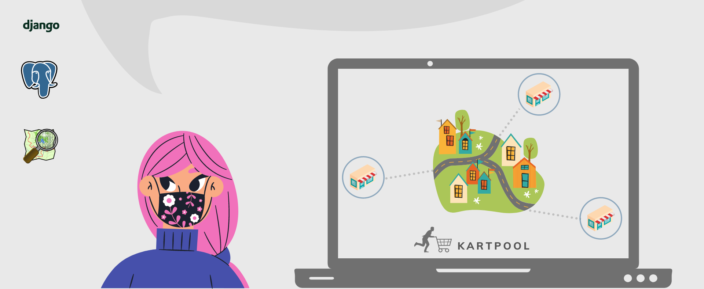

# KartPool


[](https://choosealicense.com/licenses/mit/)

KartPool is a community-driven delivery app and platform for connecting residents with local businesses. It aims to address the challenges posed by the COVID-19 pandemic by providing a safe and efficient way for people to shop for essentials and support local businesses.


## Installation & Setup

1. **Clone the repository**:

    ```sh
    git clone https://github.com/Ahmed3atef/Kartpool.git
    cd Kartpool
    ```

2. **Install System Dependencies (Ubuntu/Debian)**:
   The project requires GDAL and system libraries for GeoDjango.

    ```bash
    sudo apt-get update
    sudo apt-get install -y binutils libproj-dev gdal-bin libgdal-dev
    ```

3. **Start the Database (Docker)**:
   We use Docker to run PostgreSQL with PostGIS.

    ```bash
    # Start the database container
    docker-compose up -d
    ```

4. **Set Up Python Environment**:

    ```bash
    # Create a virtual environment
    uv venv
    source .venv/bin/activate

    # Install dependencies
    uv sync
    ```

5. **Initialize/Reset the Database**:
   Use the helper command to reset the database and enable PostGIS:

    ```bash
    docker compose run --rm reset-db
    ```

6. **Run Migrations & Create User**:
    ```bash
    python manage.py migrate
    python manage.py createsuperuser
    ```

## Execution / Usage

To run KartPool locally:

1. Ensure the Docker database is running:

    ```bash
    docker-compose up -d db
    ```

2. Start the Django development server:
    ```bash
    python manage.py runserver
    ```

**Note:** The application expects the database credentials to be configured via environment variables or use the default Docker settings provided in `settings.py`.

## Technologies

KartPool uses the following technologies and tools:

-   **Python 3**: Programming language.
-   **Django**: Web framework for developing the application.
-   **GeoDjango**: Django module for geographic web applications.
-   **PostgreSQL**: Database for data storage.
-   **PostGIS**: Extension for PostgreSQL to handle spatial data

## Features

KartPool currently has the following set of features:

1. **Store Locator**: Users can view stores in their vicinity and check their inventory.
2. **Wishlist Creation**: Users can create wishlists of essential items they need to purchase.
3. **Community Delivery**: Other users (wishmasters) can accept requests and deliver items to requestors.
4. **Karma Points**: A recognition system to appreciate helpful community members.

## Why KartPool?

-   Promotes community engagement and mutual support
-   Reduces exposure risk by minimizing trips to stores
-   Supports local businesses during challenging times
-   Provides a digital infrastructure for businesses lacking online presence

## Contributing

To contribute to the development of KartPool, follow the steps below:

1. Fork KartPool from <https://github.com/Ahmed3atef/Kartpool.git>
2. Create your feature branch (`git checkout -b feature-new`)
3. Make your changes
4. Commit your changes (`git commit -am 'Add some new feature'`)
5. Push to the branch (`git push origin feature-new`)
6. Create a new pull request

## License

KartPool is distributed under the MIT license. See [`LICENSE`](LICENSE.md) for more details.
